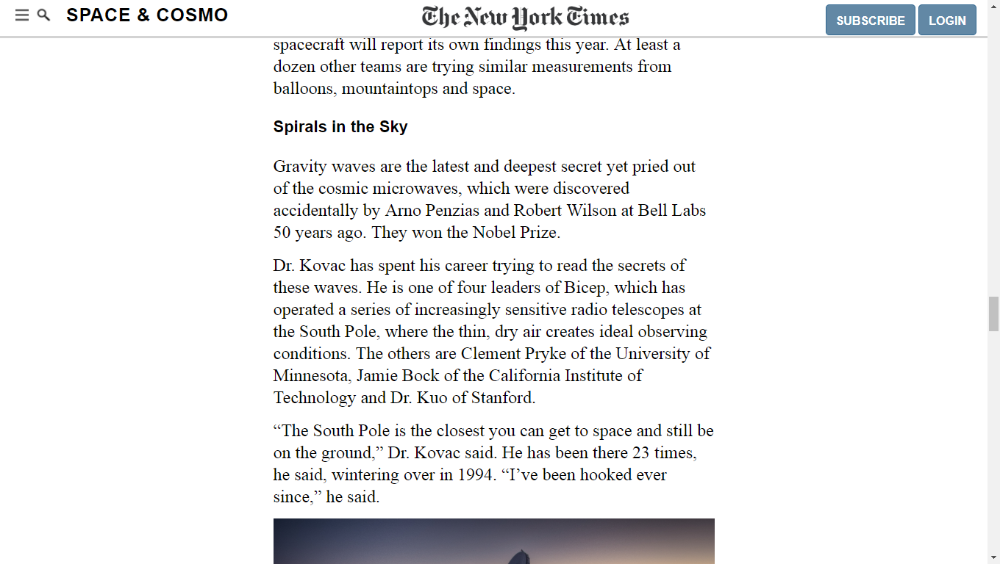

# Position and Floting Elemnts

This is the third project of the Main HTML/CSS curriculum at [Microverse](https://www.microverse.org/) - @microverseinc
* The goal was to recreate an article The New York Times
* The project was completed using simple html and css 

#### [Assignment link](https://www.theodinproject.com/courses/html5-and-css3/lessons/positioning-and-floating-elements)

#### [Live Version](https://raw.githack.com/gustavocesena/positionAndFlotingElements/debug2/index.html)

#### Screenshots

#### Authors

* [@Flover](https://github.com/flov3rh)
* [@Gus](https://github.com/gustavocesena/)

